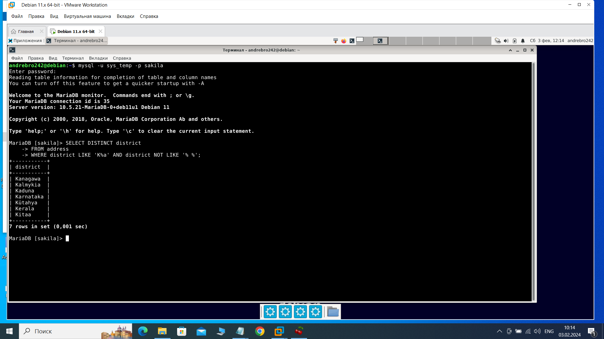
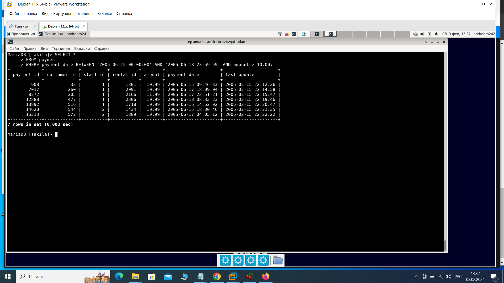
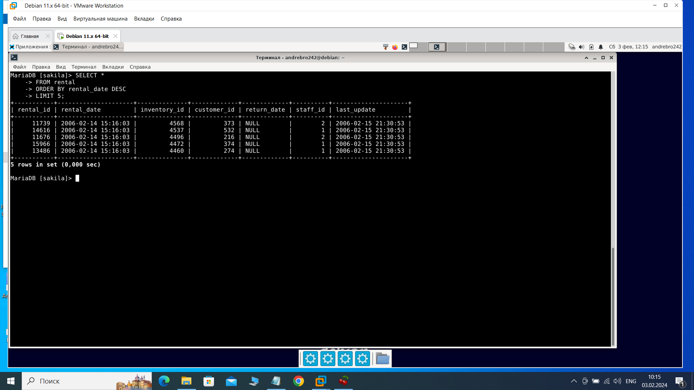
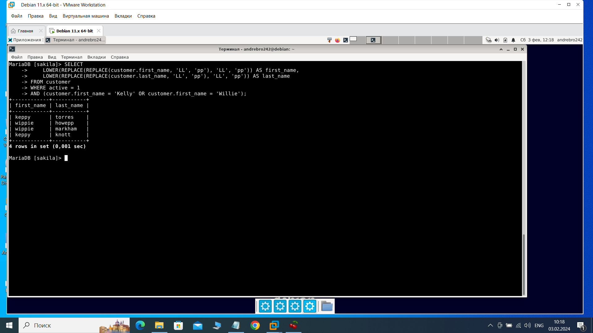
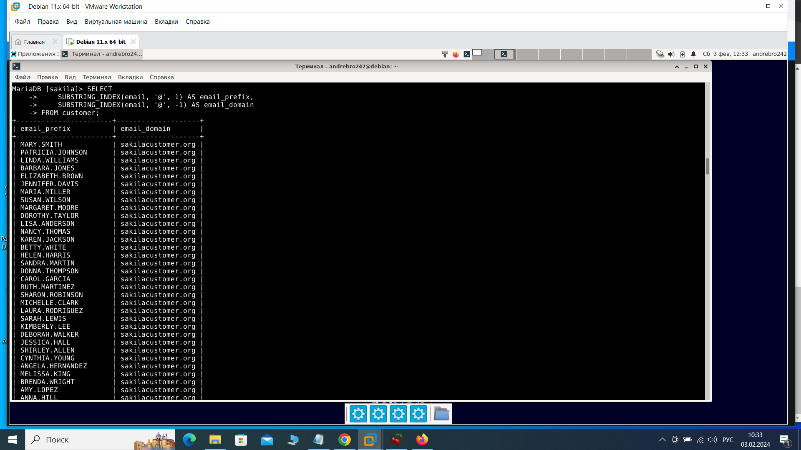
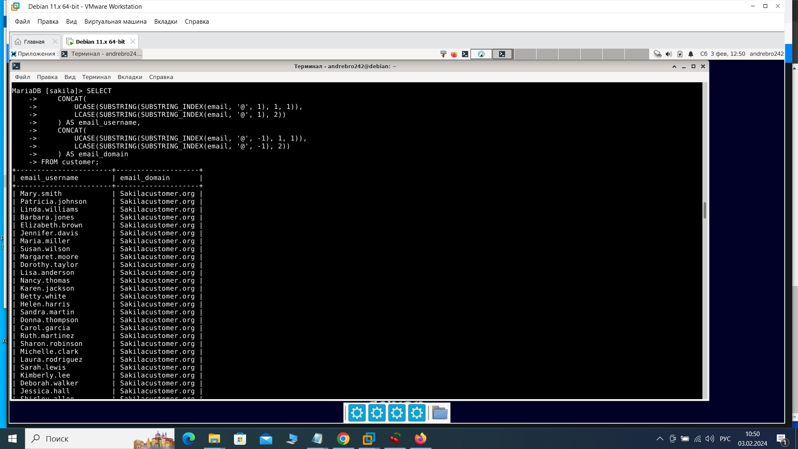

Домашнее задание по лекции "SQL. Часть 1" Брюхов А SYS-26

Задание 1
Получите уникальные названия районов из таблицы с адресами, которые начинаются на “K” и заканчиваются на “a” и не содержат пробелов.

Решение 1
    SELECT DISTINCT district
    FROM address
    WHERE district LIKE 'K%a' AND district NOT LIKE '% %';

Задание 2
Получите из таблицы платежей за прокат фильмов информацию по платежам, которые выполнялись в промежуток с 15 июня 2005 года по 18 июня 2005 года включительно и стоимость которых превышает 10.00.

Решение 2
    SELECT *
    FROM payment
    WHERE payment_date BETWEEN '2005-06-15 00:00:00' AND '2005-06-18 23:59:59' AND amount > 10.00;

Задание 3
Получите последние пять аренд фильмов.

Решение 3
    SELECT *
    FROM rental
    ORDER BY rental_date DESC
    LIMIT 5;

Задание 4
Одним запросом получите активных покупателей, имена которых Kelly или Willie.

Сформируйте вывод в результат таким образом:

все буквы в фамилии и имени из верхнего регистра переведите в нижний регистр,
замените буквы 'll' в именах на 'pp'.

Решение 4
    SELECT 
    LOWER(REPLACE(REPLACE(customer.first_name, 'LL', 'pp'), 'LL', 'pp')) AS first_name,
    LOWER(REPLACE(REPLACE(customer.last_name, 'LL', 'pp'), 'LL', 'pp')) AS last_name
    FROM customer
    WHERE active = 1
    AND (customer.first_name = 'Kelly' OR customer.first_name = 'Willie');

Задание 5*
Выведите Email каждого покупателя, разделив значение Email на две отдельных колонки: в первой колонке должно быть значение, указанное до @, во второй — значение, указанное после @.

Решение 5
    SELECT 
    SUBSTRING_INDEX(email, '@', 1) AS email_prefix,
    SUBSTRING_INDEX(email, '@', -1) AS email_domain
    FROM customer;

Задание 6*
Доработайте запрос из предыдущего задания, скорректируйте значения в новых колонках: первая буква должна быть заглавной, остальные — строчными.

Решение 6
    SELECT 
    CONCAT(
        UCASE(SUBSTRING(SUBSTRING_INDEX(email, '@', 1), 1, 1)),
        LCASE(SUBSTRING(SUBSTRING_INDEX(email, '@', 1), 2)) 
    ) AS email_username,
    CONCAT(
        UCASE(SUBSTRING(SUBSTRING_INDEX(email, '@', -1), 1, 1)),
        LCASE(SUBSTRING(SUBSTRING_INDEX(email, '@', -1), 2)) 
    ) AS email_domain
    FROM customer;

